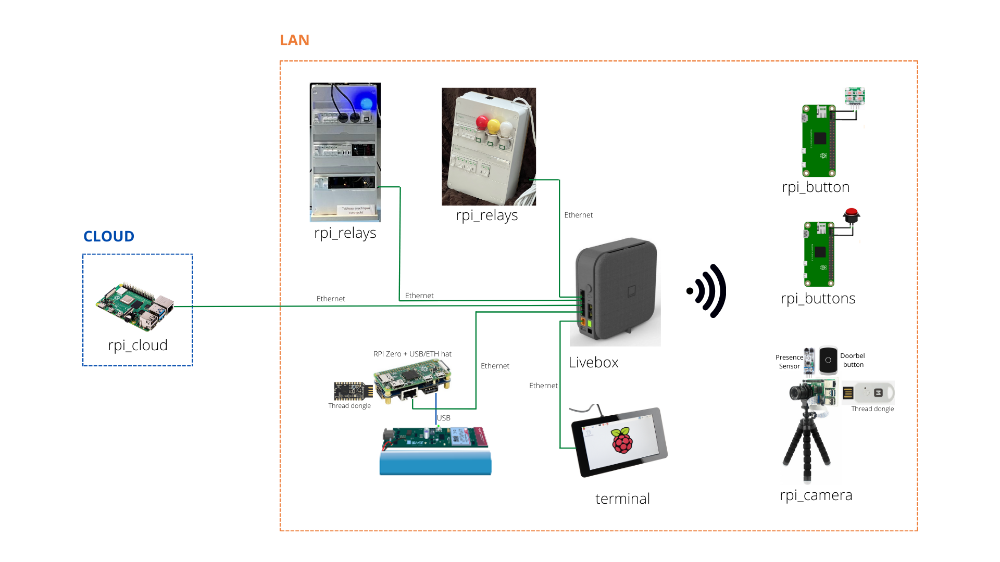

# GreenHomeLan_RpiButtons_Actions
Buttons matrix to command orchestrator via Wifi over MQTT or via Thread to the orchestrator

# RPI-Buttons_Actions

# Use case : Buttons Matrix to control orchestrator

This use case aims to show how to control the ochestrator via an object (Thread / Wifi)

## **Topology**
TODO: update image

## [**rpi_box**](https://github.com/Nicolas44Hernandez/GreenHomeLan_RpiBox)
Runs the intelligence of the orchestrator, this RPI commands the Wi-Fi bands of the livebox via telnet and acts as a border router for the Thread network. This code could be integrated into the livebox in future versions.
The orchestrator notifies periodically the current use situation and the Wi-Fi status to the cloud server.

## [**rpi_relays**](https://github.com/Nicolas44Hernandez/GreenHomeLan_RpiPanel)
Connected electrical panel, this panel is controlled by the orchestrator to manage the energy resources of the house.
Currently, for demo purposes, three of its relays are used as a visual notification of the status of the Wi-Fi bands as follows:
- 2.4 GHz : red
- 5 GHz: yellow
- 6 GHz: white

## [**rpi_cloud**](https://github.com/Nicolas44Hernandez/GreenHomeLan_RpiCloud)
Run a web server where connected users receive notifications and have access to the live video stream from the rpi_camera
This module is not part of the local network, it simulates a cloud web service.

## [**rpi_camera**](https://github.com/Nicolas44Hernandez/GreenHomeLan_RpiCamera)
Connected object composed a doorbell, a camera and a presence sensor. This smart doorbell sends a notification and the live video stream to the cloud server (rpi_cloud) if someone rings the bell or the presence sensor detects something unusual.

## [**rpi_button**](https://github.com/Nicolas44Hernandez/GreenHomeLan_RpiButton)
Connected object composed a button. This emergency smart button sends a resiliant notification to the cloud server (rpi_cloud) via Wifi / Thread

## **rpi_button_actions**
Connected object composed a 2x2 button matrix. This button matrix controls the orchestrator via Wifi / Thread

## rpi_button_actions installation and setup
You can found the installation and setup in the iner [README.md](server_buttons/README.md) file
