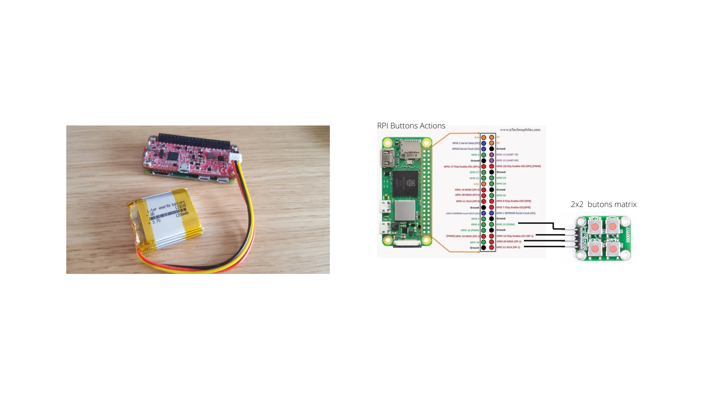

# RPI Button

# OS installation
You can use the [Raspberry Pi Imager](https://www.raspberrypi.com/software/) to flash the last 64-bit Bullseye ligth version (no desktop)


# Initial setup

Use raspi-config to configure the RPI
```bash
sudo raspi-config
```
- Configure the SSH interface
- Connect to your Wi-Fi network (you must have an internet connection)

## Update OS

```bash
sudo apt update
sudo apt upgrade
```

## Clone rpi_box repository

```bash
mkdir workspace
cd workspace
git clone https://github.com/Nicolas44Hernandez/GreenHomeLan_RpiButtons_Actions.git
```

## Install pip3

```bash
sudo apt-get install python3-pip
```

## Install the dependencies
```bash
cd GreenHomeLan_RpiButtons_Actions
pip install -r server_buttons/requirements.txt
```

To add the dependencies to PATH, edit the `bashrc` file

```bash
nano ~/.bashrc
```
add line
```
export PATH="$PATH:/home/pi/.local/bin"
```

Install pijuice
```bash
sudo apt-get install pijuice-base
```

## Add the WiGreen Wi-Fi network configuration

Edit the file `wpa_supplicant.conf`
```bash
sudo nano /etc/wpa_supplicant/supplicant.conf
```

replace netxwork config by
```
network={
        ssid="Livebox-Wigreen"
        psk="Wigreen1234"
}
```

## Create log files

Log files defined in configuration file located in *server_box/server/config/logging-config.yml* must be created before launching the application

```bash
mkdir logs
touch logs/app.log logs/thread.log logs/buttons.log logs/battery.log
```

# Hardware connection
Connect the buttons matrix to the RPI


# Set rpi-buttons-matrix as a service

## Configuration
In the file `server_buttons/server/config/button-matrix-config.yml`

## Set the app as a service

Copy the service file
```bash
sudo cp server_buttons/service/rpi-buttons-matrix.service /etc/systemd/system/
```

Register service
```bash
sudo systemctl daemon-reload
sudo systemctl enable rpi-buttons-matrix
sudo systemctl restart rpi-buttons-matrix
```
